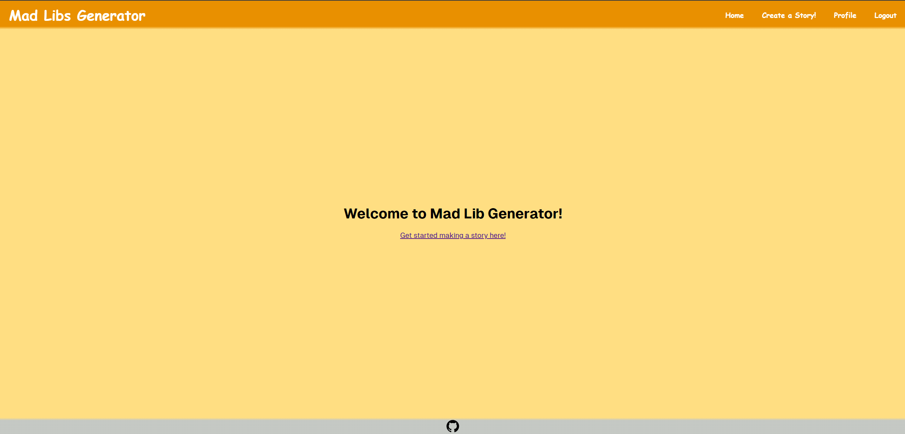
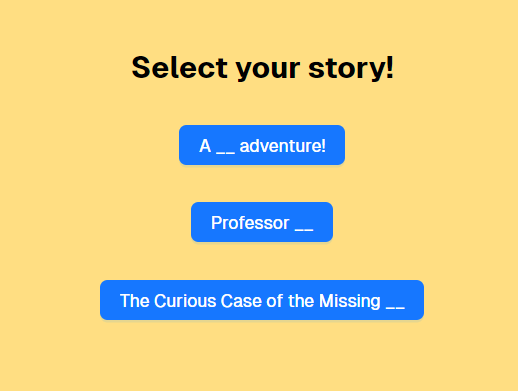

# team-M-s-project-3

## Description
This is a mad lib generator website. Select a story, fill in the blanks, and enjoy your silly story!

## Usage
Use this website for a fun activity with friends.

## Installation
Run "npm i" in the command line to install all package dependencies.
Run "npm run develop" to boot up the server and start interacting with the website.

## License
N/A

## Contributors
Mike Berry
Zachary Roy
Ethan Stone